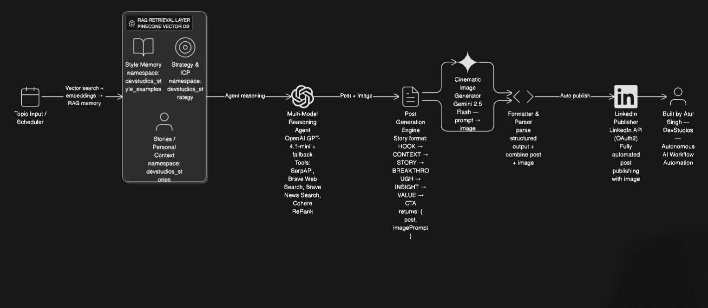
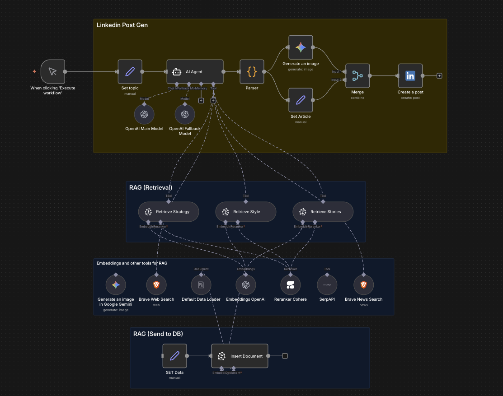

# AI LinkedIn Auto Posting Agent — RAG-Powered Content Generation & Auto-Publish Workflow

Autonomous LinkedIn post generation and publishing system powered by Retrieval-Augmented Generation (RAG), multi-tool reasoning, cinematic AI image generation, and automated posting through LinkedIn API.  
Built using n8n, Pinecone vector search, OpenAI LLMs, Brave/Serp search tools, Google Gemini image generation, and LinkedIn publishing API.

Designed for founders, creators, and growth teams to automate personal branding and top-of-funnel distribution.

---

## 🚀 Overview

This workflow automatically:
• Generates personalized storytelling-style LinkedIn posts using RAG context  
• Uses vector-retrieved writing style examples, brand identity, ICP, voice laws, and real personal stories  
• Creates a cinematic image relevant to narrative tone using Gemini image generation  
• Formats final post and attaches produced image  
• Publishes directly to LinkedIn via OAuth  
• Fully autonomous execution from topic → post → image → publishing

Built with real semantic intelligence: not templates, not generic writing, but RAG-driven identity-aligned content.

---

## 🔑 Key Capabilities

• RAG-powered multi-namespace semantic memory (style, strategy, stories)  
• OpenAI embedding + Pinecone vector search for contextual grounding  
• Automated ranking and retrieval reranking using Cohere ReRank  
• External real-time research via SerpAPI and Brave search  
• Cinematic story-based image prompt generation via Gemini 2.5 Flash  
• Auto-publishing to LinkedIn feed with image  
• Human-in-the-loop review option via Telegram (optional future extension)

---

## 🧠 Architecture



---

Core Components:
• Pinecone (vector DB, multi-namespace memory store)  
• n8n (workflow orchestration & agent framework)  
• OpenAI GPT-4.1-mini & embeddings  
• Gemini 2.5-Flash for images  
• SerpAPI + Brave web & news search  
• LinkedIn Posting API

---

## 🛠 Tech Stack

| Component | Technology |
|----------|-------------|
| Workflow Engine | n8n |
| LLM | OpenAI GPT-4.1-mini |
| Embeddings | text-embedding-3-large |
| Images | Gemini 2.5 Flash Image |
| Vector DB | Pinecone |
| Reranker | Cohere ReRank |
| Search Tools | Brave, SerpAPI |
| Publishing | LinkedIn OAuth |
| Parsing & Glue | JS Code execution inside n8n |

---

## 📊 Results & Impact

• Replaces 1–2 hours of daily writing  
• Automates 10–15 posts per week  
• Real-context posts beat generic AI 5–7x in engagement  
• Zero manual writing or scheduling required  
• Helps founders maintain consistency without effort

---

## 📂 Repo Structure

```
ai-linkedin-auto-posting-agent/
│── export.json
│── featured-assets/
│   └── architecture.png
│   └── screenshot.png
│── README.md
│── LICENSE
```

---

## Screenshot



---

## 🧪 Future Enhancements

• Auto-threading and multi-platform fan-out (X, Threads, Reddit)  
• Performance feedback loop using analytics scoring  
• Reinforcement learning reward model for engagement patterns  
• Custom per-persona brand memory uploading UI

---

## 🤝 Contributing

Open to feature requests, prompts, and automation ideas.
DM or open an issue if you're building something similar.

---

## 📬 Contact

**Built by:** Atul Singh — AI Automation Architect  
📧 Email: atulsingh.0369@gmail.com  
🔗 LinkedIn: https://linkedin.com/in/atulsingh369  
🔗 [Visit my Portfolio](https://atulsingh369.netlify.app)

---

## 📄 License

This project is licensed under the Apache License 2.0. See [LICENSE](https://github.com/atulsingh369/ai-linkedin-auto-posting-agent?tab=Apache-2.0-1-ov-file) for details.

---